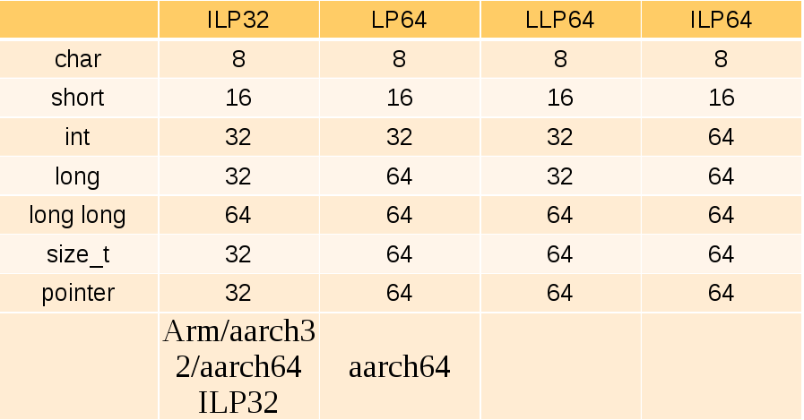
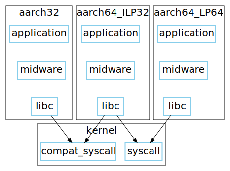
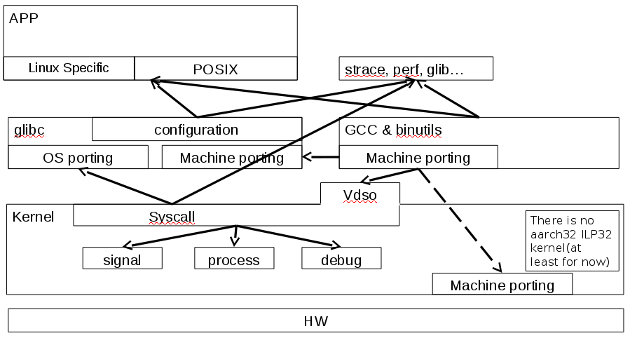
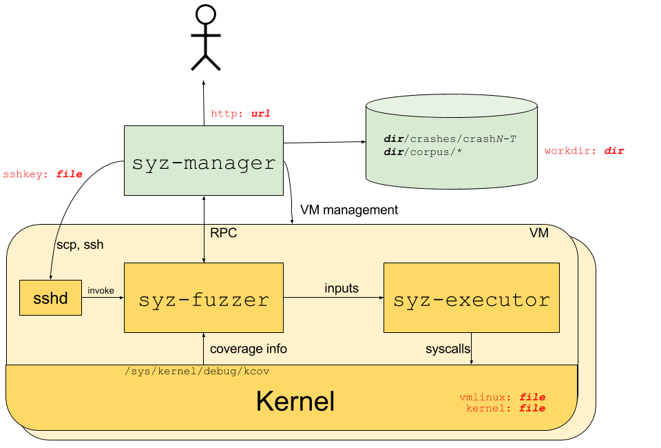
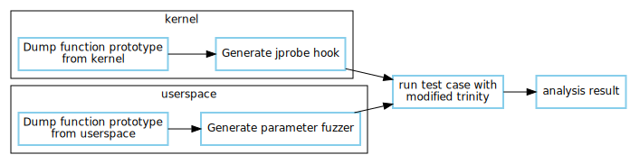

class: center, middle

#An efficient unit test and fuzz tools for kernel/libc porting

Bamvor Jian Zhang

Huawei

.date[Oct, 6, 2016]

???
cmd: markdown-to-slides --style remark-template.css --l template.html -d ILP32_syscall_unit_test_linuxcon_europe.md -o ILP32_syscall_unit_test_linuxcon_europe.html

The idea is:
1.  Share the experience of development of ILP32 which show the lack of syscall unit test
2.  Compare the exist testsuite for kernel and glibc. The shortage
3.  Introduce our syscall unit test which based on trinity

## Self introduction
*   Kernel developer from Huawei
*   Linaro kernel working group assignee
*   Focus on migration of 32-bit application
*   Interested in in memory management

???
ILP32 is one of three abis existing on arm64. Which provide a software migration path from arm 32bit hardware to 64bit hardware.
Migrate from arm 32-bit hardware to 64-bit hardware which include the features, interfaces and kabi.
Mentioned the THP code?

# aarch64 ILP32 overview
???
ILP32 is one of three ABIs existing on arm64. Which provide a software migration path from arm 32-bit hardware to 64-bit hardware

## What is ILP32?
### Data model


### arm architecture


### Migrate 32-bit application to 64-bit hardware


### ILP32 enablement


## Why we need unit test for ILP32?
### There are actually lots of choices to be made for a new api
*   The definition of basic type in userspace
*   Argument passing
*   Sanitize register contents

???
Such as time_t, off_t(file relative types) and so on

## Four big changes in 3 years

### Version A
*   Most of syscall is compat syscall
*   time_t and off_t is 32-bit

### Version B
*   Most of syscall is as same as 64-bit syscall
*   time_t and off_t is 64-bit.
*   Incompatible with arm32 compat-ioctl
???
Glibc community think that time_t must be 32-bit. 32-bit time_t lead to incompatible with arm32 compat-ioctl

### Version C
Come back to verion A

*   Most of syscall is compat syscall
*   time_t and off_t is 32-bit
*   Pass 64-bit variable through one 64-bit reg
*   Do the sign extension when enter into kernel
???
It is hard to maintain the code of glibc because of the arguments passing and delouse

### Version D
*   Most of syscall is compat syscall
*   time_t is 32-bit and **off_t is 64-bit**(only affect the userspace interface!)
*   Pass 64-bit variable through two 32-bit register instead of one 64-bit register
*   Clear the top-halves of of all the 64-bit registers of syscall when enter kernel
???
Current version. Glibc community is re-organzie the code for a generic new api

## How many issues found by trinity when LTP syscall fails is < 20?

## 0

# Compare existing kernel/glibc test tools
## Compare existing kernel/glibc test tools
*   Whether easy to reproduce a failure
*   Whether support coverage
*   Whether support libc test
*   Whether generate full random data to basic data type

## LTP and glibc testsuite
*   The tradition testsuite for kernel and glibc
*   No fuzz test. Test may pass while some issues are hidden.

## [Trinity](https://github.com/kernelslacker/trinity)
*   Generate fuzz data in a set of data type
*   Generate random address instead of basic data type for most of pointers
*   Support lots of architecture
*   Takes too long to produce an issue and takes much longer to re-produce and analyze it
*   Is going to add coverage support(?)

???
Trinity is developed in a long time. It could randomize the parameter of syscall and run individual syscall standalone or parallel. When I do the long time parallel test(not for ILP32), it could report some bug, e.g. hang, panic. It is useful but it is indeed hard to debug because it usually fail after a long time running. I do not know what does it exactly do

## [Syzkaller](https://github.com/google/syzkaller)


.footnote[.red[*] The original [picture](https://github.com/google/syzkaller/blob/master/structure.png?raw=true) is belong to the syzkaller project]
???
The picture came from https://github.com/google/syzkaller

## Syzkaller(Cont.)
*   Syzkaller can recursively randomize base data type
*   Syzkaller can generate readable short testcases
*   Syzkaller can do the coverage
*   Syzkaller does not test glibc

???
Compare with Trinity, syzkaller is quite different. Here is the comparision between syzkaller and our tools:
1.  Syzkaller could recursively randomize base date type in syscall which means it is possible generate more meaningfull syscall test. But it only test the syscall through syscall() function. It assume that the c library is correct and stable. But it is wrong if we are porting new ABI(such as ILP32) or architecture to glibc and kernel. We need to take c library into account. This is what my tools could do

2.  Syzkaller could generate the readable short testcases. Our tools could only test individual syscall and check the correctness of parameter and return value. I think it is enough for the unit test which tests syscall one by one

3.  Syzkaller could do the coverage. Our tools could not. I think it is useful for me. I plan to add the coverage later
The main function in syz-fuzzer/fuzzer.go will check whether kcov is enabled when noCover flag is not set.  Function triageInput is only used when noCover is not set. It will generate the score of coverage difference.  It seems that syz-fuzzer/fuzzer.go call BuildChoiceTable to generate the syscall list which is the input for syz-executor

## AFL and [Triforce](https://github.com/nccgroup/TriforceLinuxSyscallFuzzer)
*   Base on the [TriforceAFL](https://github.com/nccgroup/TriforceAFL)
*   Do not need the coverage support in kernel
    Cool for the old kernel
*   Need special instruction in qemu

???
Project Triforce: Run AFL on Everything!
http://codemonkey.org.uk/2015/05/05/thoughts-feedback-loop-trinity/
quotes:
I awoke suddenly with a crazy idea: "Run AFL on the Linux Kernel."
Well, this isn't exactly a totally new idea. In fact, Google has had a very successfully feedback-driven Linux syscall fuzzer, syzkaller. Trinity 1, perhaps the most successful Linux system call fuzzer, briefly considered adding feedback support. Oracle recently showed some very intersting work on using AFL to fuzz Linux filesystem drivers.
Unlike syzkaller, kernels don't need to be built with coverage support. Any kernel will do. And, since we're capturing edge info (rather than coverage), we get the full benefits of AFL's feedback engine.
If the operating system uses any other resources besides memory, these resources will not be isolated between test cases. For this reason, its usually desirable to boot the operating system using an in-memory filesystem, such as a Linux ramdisk image.
The driver communicates with the virtual machine through a special instruction that was added to the QEMU x64 CPU that we call aflCall (0f 24).
Using TriforceAFL, we built a Linux syscall fuzzer (TriforceLinuxSyscallFuzzer). We'll have a whitepaper coming out soon detailing how we built it, how we generated test cases, how it works, and analyzing the bugs it found.

## What's missing?
*   There is no testsuite care about the porting of libc and kernel
*   There is no full unit test for syscall

???
*   The developer who do the port is care about both kernel and libc
*   There is no full unit test for syscall. These tools assume that the parameter passing is correct from userspace/libc to kernel. It may lead to strage issue for test which is not easy to debug

# Introduce syscall unit test

## The test flow of syscall unit test


???
Dump the function                                 Dump the function
prototype from                                    prototype from c
vmlinux from the                                  library from the
sys_call_table                                    given list(posix
array in kernel.                                  interfaces or user
       |                                          defined)
       |                                                 |
       |                                                 |
      \|/                                               \|/
       `                                                 `
Generate jprobe        Modity Trinity to          Generate struct
hook according to      support run syscall        fuzz generator
prototype which        syscall from c             from the prototype
will recursively       libray instead             And add them of
print the syscall      syscall() function         to trinity. Trinity
value.                       |                    will recursively
       \                     |                    print the function
        \                    |                    parameter
         \                   |                           /
          -----------------------------------------------
                             |
                            \|/
                             `
              Run the trinity each syscall once
              and compare the function parameter
              printed in kernel and userspace
              If inconsistent, print specific
              information, such endian issue,
              32<->64-bit conversion issue and
              so on

### Dump the prototype of function and struct
*   Script base on [abi-dumper](https://github.com/lvc/abi-dumper.git)
*   Generate the function and struct fuzz from json.

### The fuzzer of struct in userspace
```cpp
struct itimerspec *get_itimerspec()
{
    struct itimerspec *p = malloc(sizeof(struct itimerspec));

    p->it_interval.tv_sec = (unsigned long) rand64();
    p->it_interval.tv_nsec = (unsigned long) rand64();
    p->it_value.tv_sec = (unsigned long) rand64();
    p->it_value.tv_nsec = (unsigned long) rand64();

    //print all the value of this struct
    return p;
}
```

### The Jprobe hook in kernel module
```cpp
long JC_SyS_getitimer(int which, struct compat_itimerval *it)
{
    printk("parameter value:it<%u>, which<%u>", it, which);
    printk("it->it_interval.tv_sec<%u>, it->it_interval.tv_usec<%u>, it->it_value.tv_sec<%u>, it->it_value.tv_usec<%u>",
            it->it_interval.tv_sec, it->it_interval.tv_usec,
            it->it_value.tv_sec, it->it_value.tv_usec);
    jprobe_return();        /* Always end with a call to jprobe_return(). */
    return 0;
}

static struct jprobe my_jprobe = {
    .entry = JC_SyS_getitimer,
    .kp = {
    .    symbol_name = "compat_sys_getitimer",
    },
};
```
---
```cpp
static int __init jprobe_init(void)
{
    int ret;

    ret = register_jprobe(&my_jprobe);
    if (ret < 0) {
            printk(KERN_INFO "register_jprobe failed, returned %d\n", ret);
            return -1;
    }

    return 0;
}

static void __exit jprobe_exit(void)
{
    unregister_jprobe(&my_jprobe);
    printk(KERN_INFO "jprobe at %p unregistered\n", my_jprobe.kp.addr);
}
```

???
Step to generate generate-struct.c and jprobe hooks:
1.  Compile the kernel/libc/binary which include the functions you want to generate.
2.  Dump function and struct information through modified abi-dumper.pl, named them as symbolinfo and typeinfo. You may need add "--all" and/or "--dump-static" depends on your binaries.
3.  Generate the file through trinity/scripts/struct_extract.py.

### Modify trinity
*   Call syscall through c library
*   Add the missing struct in syscall
*   Add jprobe hooks for capturing the argument of syscall
*   Add or Change some output message for script

???
There are some hacks and the original funtion of trinity may be broken. The main changes in trinity are as follows:
1.  Call syscall through c library via call_glibc_syscalls() instead of direct syscall via syscall().
2.  Add new file generate-struct.c including the missing data type mentioned in syscall. This file is generated by ./struct_extract.py with a little modification. It should be fully auto generated in future.
3.  Add more date types in fill_arg()(generate-args.c) and include/syscall.h.
4.  Modify the syscallentry struct in syscalls directory according to the newly added data types.
5.  Add or Change some output message for script.
6.  Add jprobe hooks in modules directory. Such hook will be inserted before trinity test and removed after test.

### Run it!
trinity/scripts/do_test_struct.sh

## Found two issues with our tools in a specific version
*   readahead
*   sync_file_range

## The return value test of syscall
*   Random return value through kretprobe

???
Random return the value of syscall to userspace to in order to test whether userspace handle the return value/errno correctly

## TODO list
*   Support all the syscalls which are not wrapped by libc
*   Full automation in generating the fuzz code

## What is the future of syscall unit test?
Contribute to LTP and/or glibc testsuite?

Or keep it as a standalone testsuite?

## Code published in github
<https://github.com/bjzhang/trinity/tree/syscall_unittest>

<https://github.com/bjzhang/abi-dumper/tree/json_output>

# Q & A

