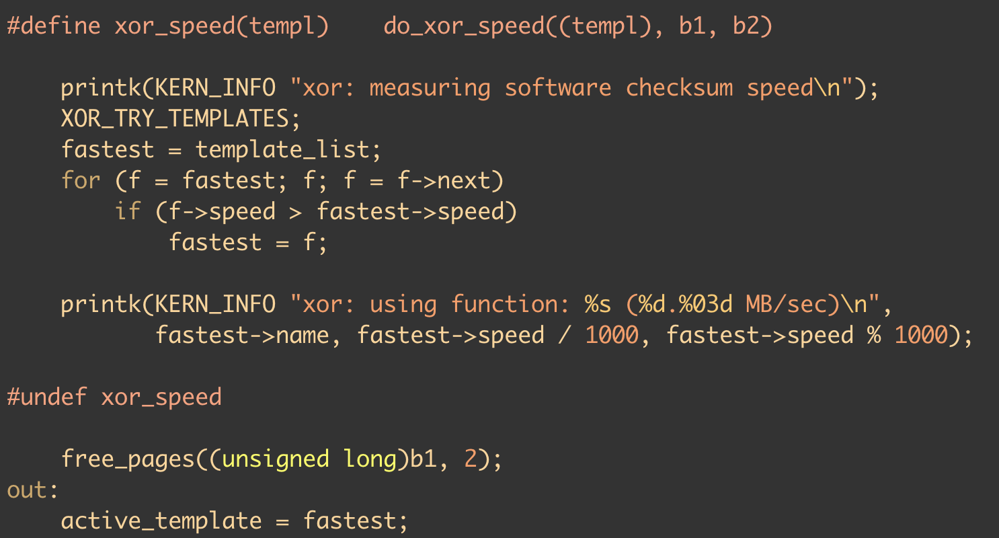

# 【日更23/365】Linux内核中使用浮点
按：看老谢的深入理解并行计算群里面讨论内核浮点数使用，自己复习了下。文章细节针对arm，也照顾了x86。对arm架构不熟悉的小伙伴可以参考健哥的ARM系列文章：
* [没有开发板怎么玩ARM](https://mp.weixin.qq.com/s/fF3bw63T9g1uEWukn-5TpQ)；
* [系统软件工程师看ARM](https://mp.weixin.qq.com/s/IElSwXK5bpXpdVans0-cUw)；
* [搭建ARM64 ACPI启动学习环境](https://mp.weixin.qq.com/s/3aCZ5m4omKnOxT-8-3sBnA)。

## 文章要点
1. 内核对用户空间使用浮点的支持；
2. 内核如何使用浮点；
3. 看了这篇文章之后能做什么。

## 已有资料
英文: arm arm,  armv8 arm, software development guide。

## 内核对用户空间使用浮点的支持
浮点寄存器并不是每次进程上下文切换都需要，所以内核采用Lazy restore。ARM64下相关flag是`TIF_FOREIGN_FPSTATE`，x86下是`TIF_NEED_FPU_LOAD`。ARM64的说明在`arch/arm64/kernel/fpsimd.c`。

## 内核如何使用浮点
一句话总结：内核中使用浮点需要专门加函数保存上下文，不同架构api可能不同。

### API
- ARM和ARM64: `kernel_neon_begin()/end()`；
- X86_64: `kernel_fpu_begin()/end() `。

### 举例
参考`crypto/xor.c`，测试之后会把性能最好的放在`active_template`里面。

## 看了这篇文章之后能做什么
1. 看ARM架构文档和用户手册了解FP，SIMD和NEON；
2. 看内核如何使用NEON；
3. 找用户空间使用NEON的例子。
4. 健哥自己打算看下armv8支持SVE，SVE相关代码。

